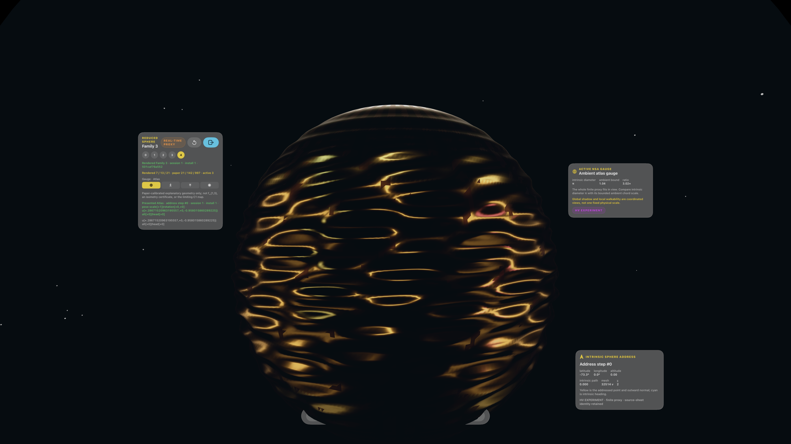
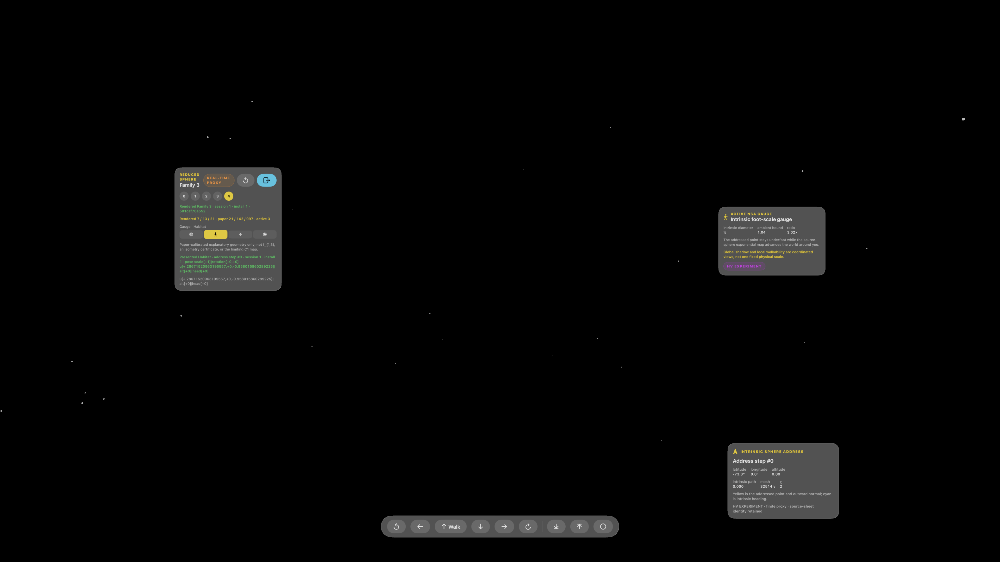
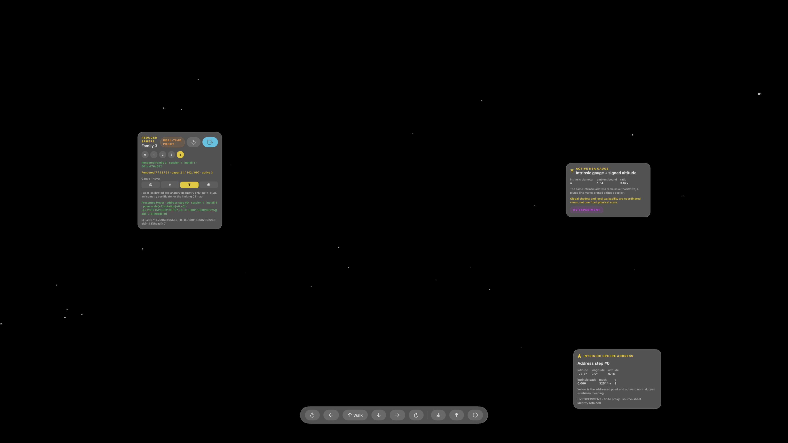
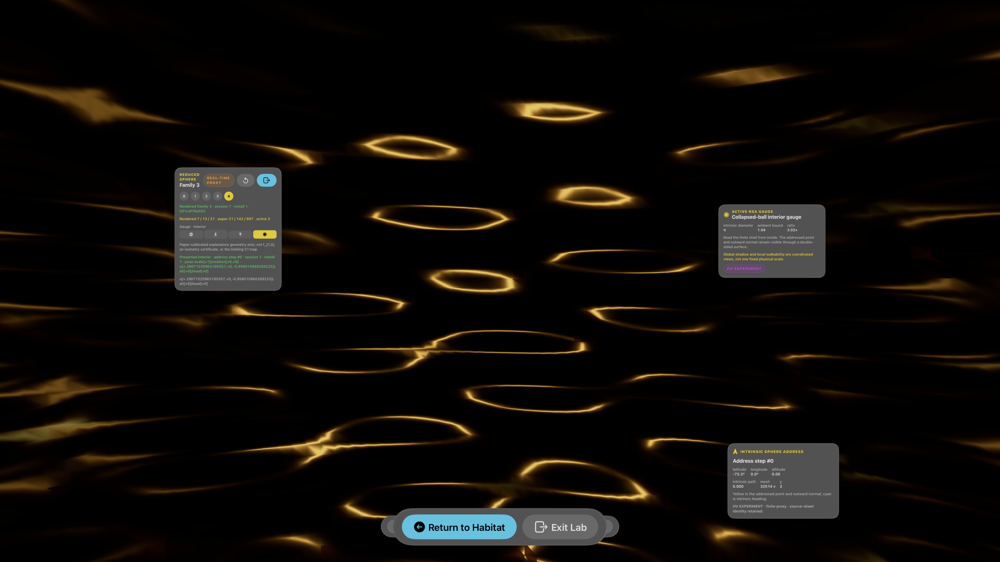
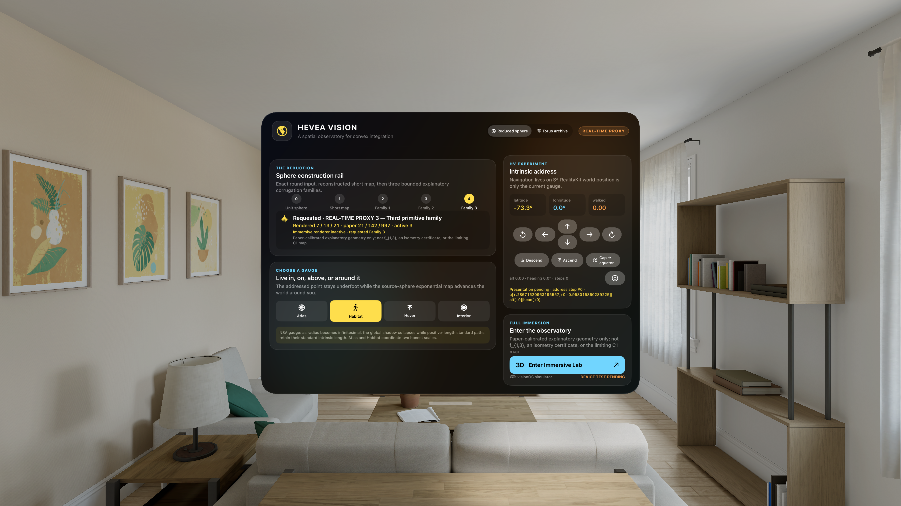
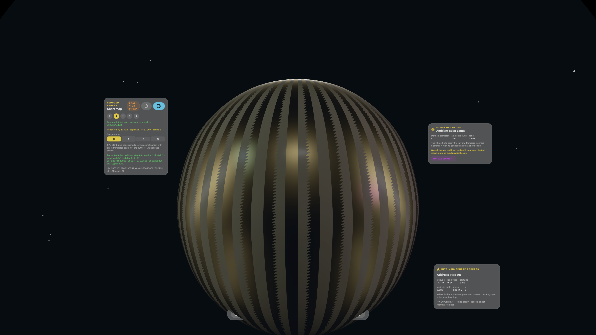
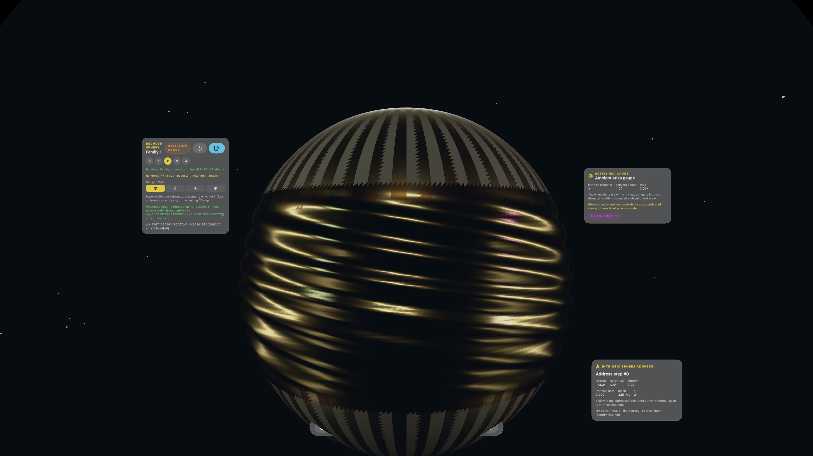

# Hévéa Vision — live inside the reduced sphere

An unofficial, open-source Apple Vision Pro observatory for the [Hévéa
project](https://hevea-project.fr/). Hévéa Vision turns the explicit reduction
of the unit sphere into a place you can view from afar, walk on, hover above,
and read from within—without pretending that an interactive finite mesh is the
paper's limiting isometry.

This is a native SwiftUI and RealityKit visionOS app, not a concept render. Its
public v1 experience centers on the reduced sphere; the earlier flat-torus
observatory remains available as an auditable archive.

<table>
  <tr>
    <td width="50%">
      
      <br><strong>Atlas</strong><br>
      Hold the whole finite reduction in view. Compare intrinsic diameter π
      with the bounded ambient diameter and the original unit-sphere ghost.
    </td>
    <td width="50%">
      
      <br><strong>Habitat</strong><br>
      Walk at source-sphere scale. Your intrinsic address stays authoritative
      while the local finite proxy is re-anchored underfoot. The forward
      simulator capture shows the instruments; the shell is below its frame.
    </td>
  </tr>
  <tr>
    <td width="50%">
      
      <br><strong>Hover</strong><br>
      Keep the same address and heading while changing signed normal altitude.
      A plumb line keeps “above” distinct from moving across the sphere. The
      near-field shell is outside this forward simulator capture.
    </td>
    <td width="50%">
      
      <br><strong>Interior</strong><br>
      Enter the bounded ball and read a double-sided shell from within. The
      addressed point and its outward normal remain visible.
    </td>
  </tr>
</table>

The four views are gauges—coordinated ways to inspect one mathematical
address—not a claim that a camera traversed every scale in ordinary Euclidean
space. The images are uncropped `simctl` captures generated from Hévéa
Vision's finite `REAL-TIME PROXY` on the visionOS 26.5 Simulator. They were
checked against an empty-room baseline and inspected by a human. They are app
documentation, not Hévéa gallery assets and not physical-headset evidence.

<table>
  <tr>
    <td width="34%">
      
      <br><strong>Mission Control</strong><br>
      The five-stage rail, four gauges, source address, paper/proxy schedules,
      and claim badges stay visible before immersion.
    </td>
    <td width="33%">
      
      <br><strong>Short map</strong><br>
      Exact translated caps meet a constrained reconstructed central ribbon.
    </td>
    <td width="33%">
      
      <br><strong>Family 1</strong><br>
      The first nested explanatory correction appears as a corrugated belt.
    </td>
  </tr>
</table>

## Why a sphere can be collapsed but still walkable

Bartzos, Borrelli, Denis, Lazarus, Rohmer, and Thibert proved that for every
standard radius `0 < r < 1`, the round unit sphere has a `C1` isometric map
whose image lies inside the ball `B_r`. The construction keeps two round caps,
inserts a short central ribbon, and uses boundary-aware convex integration on
nested ribbons. The paper's displayed finite object is a discretization of
`f₁,₃`; it is not the limiting map.

The app separates two scales that a single camera cannot honestly preserve:

- **Atlas scale** makes the collapsed image globally visible.
- **Habitat scale** preserves the source sphere as the visitor's ruler.

That division is not a visual trick hidden from the user. The active gauge,
intrinsic address, traversed intrinsic distance, altitude, rendered-stage
receipt, and geometry fingerprint are visible instruments.

## The address is the geometry

The visitor does not live at a nearest vertex in RealityKit space. The
authoritative state is

```text
SphereAddress = (q ∈ S², signed altitude a, tangent heading ψ).
```

For a tangent step `v` of length `s`, walking advances the unit source
direction by the sphere's exponential map:

```text
qNext = cos(s) q + sin(s) v/s.
```

Longitude and latitude are derived readouts, not navigation state, so pole
crossings do not create a coordinate singularity. The addressed source point
is then evaluated on the displayed reduced-sphere proxy. In Habitat and Hover,
the world is rotated and translated so that point stays locally under the
visitor while intrinsic distance accumulates. This **mathematical treadmill**
keeps world coordinates bounded without replacing intrinsic adjacency with an
ambient nearest-neighbor guess—an essential distinction when distant parts of
the source sphere fold close together inside the ball.

## What is exact, what is a proxy, and what is an experiment

Every visible result carries one of three claim classes:

| Badge | Sphere-specific meaning |
|---|---|
| `UPSTREAM BASELINE` | The exact round unit-sphere formula printed in the paper. The translated-cap formulas are also exact components, but a stage containing the reconstructed central profile remains a proxy overall. |
| `REAL-TIME PROXY` | The GPL-attributed constrained short-profile reconstruction and lower-frequency nested corrugation families. They explain the construction interactively; they are not the authors' unpublished profile, the paper's `f₁,₃`, or the limiting `C1` map. |
| `HV EXPERIMENT` | Finite topology, radius, seam, normal, metric, navigation, and fingerprint measurements made by this implementation. These are reproducible sensor readings, not theorem certificates. |

The construction rail is deliberately explicit:

| Rail stage | Rendered geometry | Claim ceiling |
|---|---|---|
| Unit sphere | Exact round formula | `UPSTREAM BASELINE` |
| Short map | Exact translated caps plus a constrained reconstructed ribbon | `REAL-TIME PROXY` |
| Family 1 | First nested primitive family, rendered `7` ridges; paper reference `21` | `REAL-TIME PROXY` |
| Family 2 | Adds the second family, rendered `13`; paper reference `142` | `REAL-TIME PROXY` |
| Family 3 | Adds the third family, rendered `21`; paper reference `997` | `REAL-TIME PROXY` |

The paper's `21 / 142 / 997` values are the visible ridge counts for its three
primitive corrections in the displayed finite computation. Hévéa Vision's
`7 / 13 / 21` counts are intentionally compressed for real-time rendering and
are retained separately in every sphere manifest. Equality of labels is never
used to imply equality of geometry.

The central profile is adapted under GPL from the independent community
project [`Juddd/hevea-reduced-sphere`](https://github.com/Juddd/hevea-reduced-sphere)
at pinned revision `c098ea6fabb994bdd2555719b64ebbe8d7fca483`.
That project is itself a constrained reconstruction, not an official release
of the paper authors' hidden coefficient vector. See [NOTICE.md](NOTICE.md)
and the [source map](docs/UPSTREAM.md) for the exact reuse boundary.

## A research companion for the scale paradox

The app is paired with a source-audited nonstandard-analysis reader:

- [canonical Markdown source](docs/research/reduced-sphere-nsa/report-source.md)
- [claim and proof-obligation ledger](docs/research/reduced-sphere-nsa/claim-ledger.md)
- [typeset PDF](output/pdf/hevea-reduced-sphere-nsa-for-alok.pdf)

The reader marks each statement as a paper result, transfer-equivalent NSA
reformulation, new corollary, app model, or open obligation. Its central app
consequence is precise: after transfer to a positive infinitesimal radius, the
internal isometry has a constant pointwise standard shadow while positive
standard path lengths remain nonzero internally. No single similarity scale
can make both global diameter and unit tangent speed appreciable and limited.
That is why Atlas and Habitat are coordinated views rather than one allegedly
literal camera scale.

The NSA interpretation is a separate research companion, not a theorem stated
by the Hévéa authors. The ledger records the dependencies and the exact claim
ceiling. The product-side contract lives in the
[inhabitable reduced-sphere specification](docs/SPHERE_EXPERIENCE_SPEC.md) and
the repository-wide [claim specification](SPEC.md).

Regenerate the PDF from the canonical source with Python managed by `uv`:

```bash
uv run \
  --with markdown \
  --with pymdown-extensions \
  Scripts/render-nsa-report-pdf.py
```

The PDF renderer also requires Node.js, Playwright, Chrome, and network access
to MathJax. The Markdown source and claim ledger remain the authoritative,
reviewable research artifacts.

## Build and test

Requirements:

- Apple-silicon macOS;
- Xcode with the visionOS 26 SDK and a Vision Pro Simulator runtime;
- Swift 6;
- [XcodeGen](https://github.com/yonaskolb/XcodeGen).

Generate the Xcode project and build the app without code signing:

```bash
xcodegen generate

xcodebuild \
  -project HeveaVision.xcodeproj \
  -scheme HeveaVision \
  -sdk xrsimulator \
  -destination 'generic/platform=visionOS Simulator' \
  CODE_SIGNING_ALLOWED=NO \
  build
```

Run the platform-neutral geometry and navigation suite:

```bash
swift test \
  --package-path Packages/HeveaCore \
  -Xswiftc -warnings-as-errors

swift test -c release \
  --package-path Packages/HeveaCore \
  -Xswiftc -warnings-as-errors
```

Run the app-model and render-receipt tests on an installed Vision Pro
Simulator, replacing the destination if needed:

```bash
xcodebuild test \
  -project HeveaVision.xcodeproj \
  -scheme HeveaVision \
  -destination 'platform=visionOS Simulator,name=Apple Vision Pro' \
  -only-testing:HeveaVisionTests
```

Current verified non-UI checkpoint:

| Suite | Verified result | What it covers |
|---|---:|---|
| `HeveaCore` | **57 tests passed** | Exact formulas, constrained-profile seams, genus-zero topology, containing-radius failure, deterministic fingerprints, explicit paper/proxy ridge metadata, pole-safe exponential-map navigation, and the retained torus diagnostics. |
| `HeveaVisionTests` | **23 tests passed** | Exhibit and gauge state, deterministic 1,000-step navigation, cap-to-equator traversal, reset, section cuts, render/presentation receipt invalidation and session/install binding, gravity-preserving Habitat/Hover transforms, signed-altitude plumb geometry, non-finite-pose rejection, and regime-specific rotation bounds. |

The complete app-model suite passed 23/23 with zero failures or skips on
visionOS Simulator 26.5, build `23O470`. The Xcode-exported summary is bound
by SHA-256
`ebbb2507754c13e9c7dab60389a2d038c4ae7155b11d102305bdca935c3e1f10`.

### Revision-bound simulator evidence

The deterministic 1,000-step model run and the dedicated visionOS 26.5 UI
workflow are separate evidence. The UI workflow reached `Address step #1000`
and awaited a current `Presented Habitat` receipt for that exact step. Its
exact test case passed in 21.501 seconds.

At app-source revision
`bdb56b834af1eadcc9136ad27d8e7ebf057a9427`, a dedicated visionOS 26.5
UI run performed 500 synthesized walk-pad taps in the repeating
`forward, right, left` pattern. After every tap it awaited a
`Presented Habitat · address step #n · …` receipt emitted only after the
matching RealityKit presentation transform was applied. The workflow checked
foreground liveness, reached step 500, dismissed the immersive space cleanly,
and witnessed Mission Control again.

| 500-update receipt | Value |
|---|---|
| Simulator | Apple Vision Pro Simulator, visionOS 26.5, build `23O470` |
| Acknowledgement loop | `905.2148829698563` seconds |
| Complete test case | `934.0711989402771` seconds |
| Summary SHA-256 | `9d42955b9c9bd9bec12702c4fb00b0c4c7e1eb610860702dbce7652288406924` |
| Test-detail SHA-256 | `e7ccdb394a64ff745331810719412f757f3b41c7de3c9431032b78377d80d215` |
| Text-receipt SHA-256 | `f071673e44592915b893de116d4ab8ffc3465a34b7389eb931ca0b0a47bad3a2` |

This establishes **500 acknowledged RealityKit presentation-transform
updates** on one installed mesh. It is not evidence of 500 regenerated meshes,
500 newly created anchors, physical footsteps, headset comfort, collision
behavior, or eye/hand interaction. The exact values and claim ceiling are also
retained in the
[`sphere-walk-500` JSON receipt](docs/simulator-evidence/sphere-walk-500-visionos-26-5.json).

A separate test/evidence commit,
`136a06209d593301fddaa8135ec5bae40c0ee048`, requested 100 construction
stage changes and 100 gauge changes. It converged to Family 3 + Atlas with the
intrinsic address preserved, then dismissed cleanly: 200 changes in 122.423
seconds, 163.399 seconds for the complete test case.
Its compact
[`sphere-stage-regime-200` JSON receipt](docs/simulator-evidence/sphere-stage-regime-200-visionos-26-5.json)
records the exact request split, timings, hashes, and claim boundary.

The two-runtime, 28-row visual matrix is retained in
[the simulator evidence report](docs/SIMULATOR_MATRIX.md) and its
[schema-2 JSON receipt](docs/simulator-evidence/reduced-sphere-release-matrix-20260829.json).
visionOS 26.5 passed 14/14 launch, PNG, log, and visible-delta rows. visionOS
27 beta built, installed, and launched 14/14, but every screenshot was
byte-identical to the empty-room baseline, so the matrix correctly remains
`partial` and makes no rendered-app claim for that beta runtime.

The Interior attachment's Return Habitat and Exit Lab controls were visible
and reported hittable on visionOS Simulator 26.5. Two synthesized attempts to
activate Return Habitat did not produce a Habitat presentation receipt, so
that activation path remains unverified on both simulator and physical Vision
Pro. Ordinary gauge controls and app-model state transitions are separately
tested; they do not prove activation of the Interior escape attachment.

## Run the research tools

The sphere/NSA reader is described above. The exact retained flat-torus scale
microscope receipt is reproduced from its historical public revision so later
sphere-core additions cannot silently change its dependency tree:

```bash
git worktree add \
  ../hevea-torus-research \
  e56f7fa0c81bf0090e7ed585a15aa705fc14b11a

cd ../hevea-torus-research

git diff --exit-code \
  68202cae55a59a71b1573c869a05ac82b87c7ee2 \
  -- Packages/HeveaCore

swift run -c release \
  --package-path Research/ScaleMicroscope \
  hevea-scale-microscope \
  --output-directory docs/research
```

Its [human-readable report](docs/research/scale-microscope-report.md) and
[typed JSON receipt](docs/research/scale-microscope-report.json) remain part of
the archive. The revision guard intentionally checks the earlier torus-core
checkpoint used for those numbers.

## Flat-torus observatory archive

The original revival release is still built into the app. It includes the
exact short-torus starting formula adapted from the pinned Hévéa GPL source,
three explanatory real-time proxy families, parameter-grid and metric
overlays, intrinsic-versus-ambient curve diagnostics, normal-scale sampling,
a synchronized Gauss sphere, sectioning, and inside/outside presentation.

The interactive torus frequencies are `5 / 8 / 13`; its manifests separately
retain the upstream reference frequencies `12 / 80 / 500`. Historical torus
screenshots, stress receipts, and the archived sections of the current
simulator evidence contract remain in
[`docs/screenshots`](docs/screenshots),
[`docs/simulator-evidence`](docs/simulator-evidence), and
[`docs/SIMULATOR_MATRIX.md`](docs/SIMULATOR_MATRIX.md). Those sections are
archive evidence, not reduced-sphere release receipts.

## Relationship to Hévéa

This repository is a respectful, unofficial extension of an active research
line:

- [official Hévéa project](https://hevea-project.fr/)
- [reduced-sphere paper](https://doi.org/10.1007/s10208-017-9360-1)
- [official reduced-sphere gallery](https://hevea-project.fr/Sphere_Gallery.html)
- [original GPL flat-torus source](https://github.com/HeveaProject/Hevea), pinned here at `e792074e4dd6319351bc957afeb16b4725d304f0`
- [live author clarification thread](https://github.com/HeveaProject/Hevea/issues/1)
- [community GPL sphere reconstruction](https://github.com/Juddd/hevea-reduced-sphere), pinned here at `c098ea6fabb994bdd2555719b64ebbe8d7fca483`

The official gallery media is separately licensed CC BY-SA 2.0 France, but no
gallery image or video is bundled in this repository. Official downloadable
WRL sphere meshes are also not redistributed because no explicit adjacent
mesh license was found. The seven release images at the top are screenshots
of this implementation. See [NOTICE.md](NOTICE.md) for credits and
boundaries.

## License and status

The combined distribution is available under GNU GPL version 3; original
files marked `GPL-3.0-or-later` retain that option, while the adapted community
sphere profile remains `GPL-3.0`. See [LICENSE](LICENSE) and
[NOTICE.md](NOTICE.md).

Hévéa Vision is an unofficial tribute and independent research prototype by
Alok Singh, developed with OpenAI Codex. It is not endorsed by the Hévéa
researchers, the cited authors, CNRS, Université Claude Bernard Lyon 1,
Université Grenoble Alpes, Apple, or their institutions. Physical Apple
Vision Pro validation remains pending.
