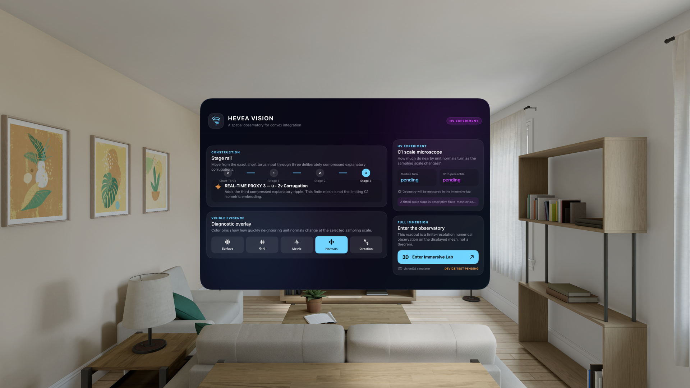
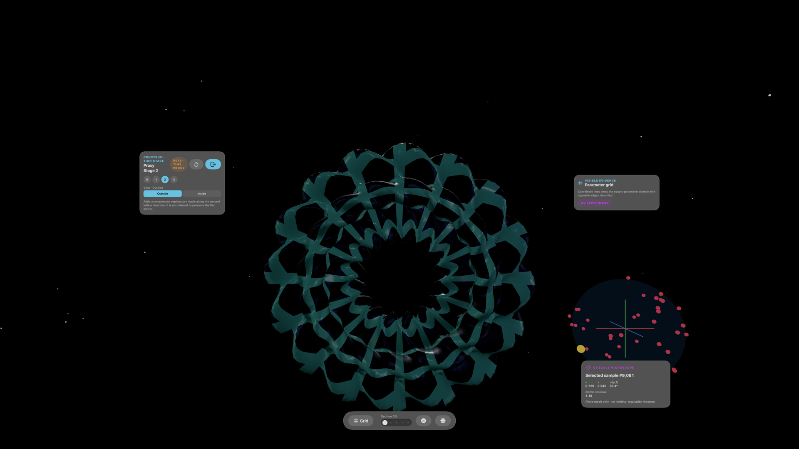
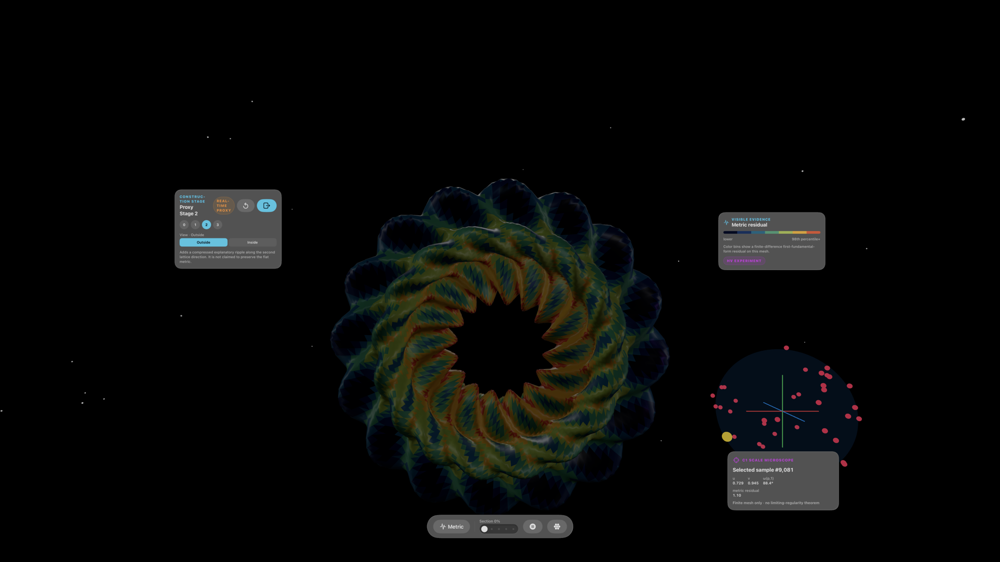
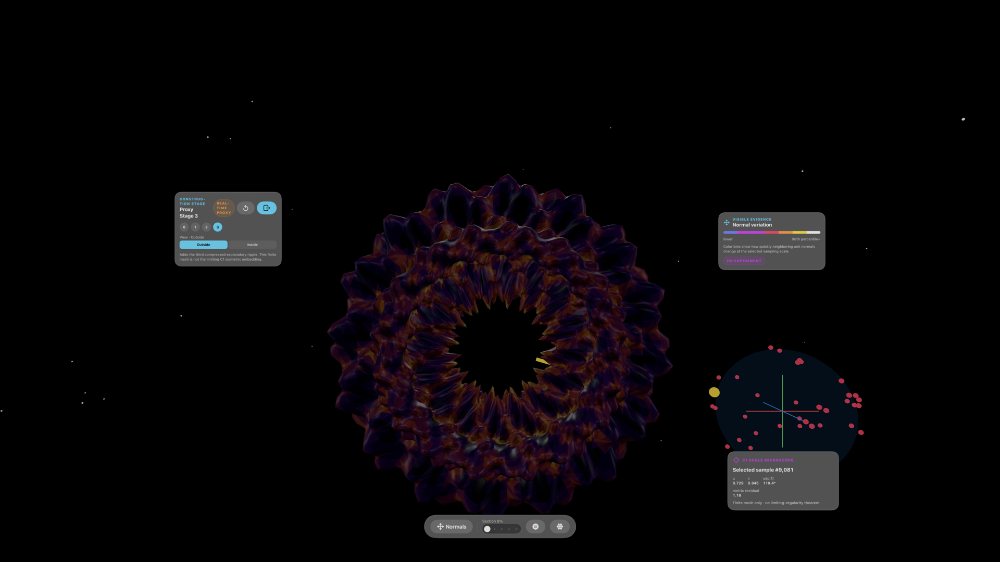

# Hévéa Vision

An unofficial, open-source Apple Vision Pro observatory for the mathematics of the [Hévéa project](https://hevea-project.fr/): flat tori, convex integration, metric defect, corrugation, Gauss maps, and finite-scale normal structure.



Hévéa made the Nash–Kuiper phenomenon computational and visible. This revival asks what happens when that work becomes a place: move through an explicit construction, stand inside a corrugated torus, compare intrinsic and ambient measurements, and inspect how the normal field changes with scale.

This is a working native visionOS prototype, not a concept render. It contains a SwiftUI Mission Control window, a full `ImmersiveSpace`, live RealityKit meshes, spatial interactions, deterministic diagnostics, automated UI workflows, a fail-closed simulator evidence harness, and a reproducible research executable.

## The observatory

<table>
  <tr>
    <td width="50%"></td>
    <td width="50%"></td>
  </tr>
  <tr>
    <td align="center"><strong>Parameter domain</strong><br>See the square flat-torus coordinates and identified directions on the surface.</td>
    <td align="center"><strong>Metric residual</strong><br>Inspect a finite-difference first-fundamental-form diagnostic on the current mesh.</td>
  </tr>
  <tr>
    <td colspan="2"></td>
  </tr>
  <tr>
    <td colspan="2" align="center"><strong>C1 scale microscope</strong><br>Select a surface sample, compare nearby unit normals over a scale ladder, and see the corresponding samples on the Gauss sphere.</td>
  </tr>
</table>

The current app supports:

- four deterministic stages: the exact short-torus formula and three deliberately compressed real-time corrugation proxies;
- surface, parameter-grid, metric-residual, normal-variation, and corrugation-direction overlays;
- tap selection, drag rotation, bounded magnification, sectioning, reset, outside view, and close-range inside view;
- synchronized stage, legend, controls, sample, and emergency-exit spatial HUDs;
- intrinsic winding-curve, ambient chord, finite-mesh metric, displacement, and normal-scale diagnostics;
- a stable accessibility identifier contract exercised through visionOS UI automation.

## Three honesty labels

The most important interface feature is epistemic, not graphical. Every exhibit states what kind of claim it can support:

| Label | Meaning in this repository |
|---|---|
| `UPSTREAM BASELINE` | A formula or generated artifact tied to a named Hévéa source path, pinned revision, parameters, and license. The current v0.1 baseline is the exact upstream short-torus formula. |
| `REAL-TIME PROXY` | An original lower-frequency surface designed for interactive explanation. It is not the historical Hévéa corrugation sequence or the limiting isometric embedding. |
| `HV EXPERIMENT` | A new, deterministic finite-mesh measurement. It is numerical evidence about the displayed samples, not a theorem. |

The runtime proxy frequencies are `5`, `8`, and `13`; the manifest separately retains the upstream reference frequencies `12`, `80`, and `500`. A finite mesh is never called the limiting C1 isometric embedding. A simulator run is never called physical-headset validation.

## Original research extension

`Research/ScaleMicroscope` turns the in-app instrument into a reproducible Swift executable. It generates all four `96 × 128` periodic meshes, measures finite-difference metric residual, evaluates complete `u` and `v` winding curves, samples normal variation at deterministic vertices over a scale ladder, fits descriptive log–log slopes, and writes typed JSON plus a human-readable report.

Headline results from the pinned run:

| Finite stage | Metric RMS | `u` winding residual | `v` winding residual | Median-normal slope | P95-normal slope | Max displacement from short torus |
|---|---:|---:|---:|---:|---:|---:|
| Short Torus | 1.21453437 | -0.80003903 | -0.37021745 | 0.98081618 | 0.98106656 | 0 |
| Proxy Stage 1 | 1.16028231 | -0.67562724 | -0.41498367 | 0.55309170 | 0.38916578 | 0.01200000 |
| Proxy Stage 2 | 1.06864371 | -0.63448152 | -0.29244463 | 0.19431871 | 0.10376240 | 0.01800000 |
| Proxy Stage 3 | 1.03341765 | -0.59569215 | -0.22649523 | 0.13624694 | 0.09733562 | 0.02143275 |

In this particular finite proxy schedule, metric RMS decreases and the fitted normal-scale slopes become shallower as corrugations are added. That does **not** establish convergence to an isometry, estimate a limiting Hölder exponent, recover the historical third stage, or prove fractal dimension. The complete methods, exclusions, configurations, and claim ceiling are in the [research report](docs/research/scale-microscope-report.md); its companion [JSON report](docs/research/scale-microscope-report.json) is byte-deterministic.

```bash
git diff --exit-code \
  68202cae55a59a71b1573c869a05ac82b87c7ee2 \
  -- Packages/HeveaCore

swift run -c release \
  --package-path Research/ScaleMicroscope \
  hevea-scale-microscope \
  --output-directory docs/research
```

Pinned artifact hashes:

```text
d1bfe4fbd277a42ab26d128c2a91b618016b8090d41de1dd6beb6dec54f963b3  scale-microscope-report.json
25b31ca9a28032bfd3a197fca7f96c30a04fa7ec7ce93b3682101ced5b817374  scale-microscope-report.md
```

## What is actually verified

The current evidence ceiling is deliberately uneven:

| Evidence | Result |
|---|---|
| `HeveaCore`, debug and release | 31 tests passed; periodic topology, exact formula landmarks, stage differences, finite channels, diagnostics, determinism, validation, and Codable round trips |
| App model | 5 tests passed |
| visionOS 26.5 UI workflows | 5 workflows passed individually: accessibility/stage rail, every overlay, immersive dismiss/reopen/stage cycle, deterministic metric relaunch, and inside-view escape contract |
| SwiftLint and Swift Format | SwiftLint passed for the full app/test target; Swift Format passed strictly for the app and UI-test sources |
| Xcode 26.5 / visionOS 26.5 | app builds; all 8 cells in the final visual matrix differ from the app-terminated baseline |
| Xcode 27 beta 5 / visionOS 27 beta | app builds and all 8 launches return PIDs, but all 8 screenshots are byte-identical to the empty-room baseline; the matrix correctly reports `partial` |
| Physical Apple Vision Pro | **not tested yet**: performance, comfort, eye/hand interaction, text placement, and inside-view recovery remain device-test pending |

The final matrix at revision `e56f7fa0c81bf0090e7ed585a15aa705fc14b11a` ran four scenarios twice on both installed runtimes: 16 launches, 16 screenshots, and 16 filtered unified logs. It produced 8/8 visible deltas on visionOS 26.5 and 0/8 on the visionOS 27 beta runtime. This exposed and fixed a hollow-validator bug: a successful `simctl launch` plus a valid PNG no longer counts as rendered evidence. See the [simulator evidence contract](docs/simulator-evidence/README.md) and [current matrix status](docs/SIMULATOR_MATRIX.md).

## Build and run

Requirements:

- macOS with Apple silicon;
- Xcode with the visionOS 26 SDK and Simulator runtime;
- [XcodeGen](https://github.com/yonaskolb/XcodeGen) for regenerating the project;
- Swift 6.

Generate and build:

```bash
xcodegen generate

xcodebuild \
  -project HeveaVision.xcodeproj \
  -scheme HeveaVision \
  -sdk xrsimulator \
  -destination 'generic/platform=visionOS Simulator' \
  CODE_SIGNING_ALLOWED=NO \
  build
```

Run the platform-neutral core tests:

```bash
swift test --package-path Packages/HeveaCore
swift test -c release --package-path Packages/HeveaCore -Xswiftc -warnings-as-errors
```

Run the bounded simulator matrix after adapting the fixed device IDs in `Scripts/run-simulator-matrix.sh` to your installed simulators:

```bash
Scripts/run-simulator-matrix.sh --preflight-only

Scripts/run-simulator-matrix.sh \
  --runtime all \
  --scenarios mission-control,stage-sweep,metric-heatmap,scale-microscope \
  --repetitions 2 \
  --settle-seconds 6 \
  --show-simulator
```

Generated runs stay under `docs/simulator-evidence/runs/` and are ignored until a human deliberately curates them. The harness has bounded scenario/repetition counts, a 16 GiB free-space floor, SHA-256 receipts, separate screenshot and visible-delta verdicts, and no simulator erase/shutdown behavior.

## Relationship to Hévéa

This repository exists because the original work deserves to remain inspectable, runnable, and surprising.

- Official project: [hevea-project.fr](https://hevea-project.fr/)
- Original GPL source: [HeveaProject/Hevea](https://github.com/HeveaProject/Hevea)
- Pinned source revision: `e792074e4dd6319351bc957afeb16b4725d304f0`
- Primary paper: [Flat tori in three-dimensional space and convex integration](https://doi.org/10.1073/pnas.1118478109)
- Reduced-sphere paper: [An Explicit Isometric Reduction of the Unit Sphere into an Arbitrarily Small Ball](https://doi.org/10.1007/s10208-017-9360-1)
- Live reduced-sphere technical exchange: [HeveaProject/Hevea issue #1](https://github.com/HeveaProject/Hevea/issues/1)

The upstream project is not literally abandoned: its current issue tracker contains a 2026 exchange with newly shared construction details and possible future source publication. Hévéa Vision should therefore be presented to the researchers as a respectful, unofficial extension and a collaboration invitation—not as a claim that their work has been forgotten.

No website mesh is redistributed here because its asset license is not explicit enough. The current screenshots are generated from this implementation. Read the [source map](docs/UPSTREAM.md), [attribution notice](NOTICE.md), and [full product/research specification](SPEC.md) before changing geometry or claims.

## Where this could go

- authenticate regenerated historical finite stages against the pinned GPL implementation;
- test the spatial composition, gestures, comfort, and performance on physical Vision Pro hardware;
- turn the current reduced-sphere reproduction seam into a collaboration with the original authors;
- explore the hyperbolic-plane Gauss-pattern experiments in a separate, equally provenance-aware exhibit;
- compare 2D and spatial explanations in a controlled comprehension study.

## License and status

GNU GPL 3.0 or later. See [LICENSE](LICENSE) and [NOTICE.md](NOTICE.md).

Hévéa Vision is an unofficial tribute and independent research prototype by Alok Singh, developed with OpenAI Codex. It is not endorsed by the Hévéa researchers, CNRS, Université Claude Bernard Lyon 1, Université Grenoble Alpes, Apple, or their institutions.
