# A sphere inside a point, while you are still walking on it

## A faithful reconstruction of Hévéa's reduced sphere in nonstandard analysis

Reader: Alok Singh

Status: canonical research source, 2026-08-29

Companion app: [Hevea Vision](https://github.com/alok/hevea-vision-pro)

Tracked work: [ALOK-846](https://linear.app/aloksingh/issue/ALOK-846/build-the-inhabitable-reduced-sphere-exhibit-and-nsa-research)

This document is intentionally optimized for one reader. It assumes that you
prefer theorem-shaped claims, typed boundaries, inspectable dependencies, and
an honest separation between a proof, a finite computation, and a visual
metaphor. It does not assume prior fluency with convex integration. It does
assume comfort with derivatives, Riemannian metrics, compactness, transfer,
and the idea that a limit can be represented by an unlimited hyperfinite
stage.

The exposition is newly written. It follows the mathematical order and
equation numbering of Bartzos–Borrelli–Denis–Lazarus–Rohmer–Thibert without
reproducing their copyrighted prose or figures.

### Claim labels

- **[PAPER]** — stated or proved in the reduced-sphere paper.
- **[NSA-EQUIV]** — an equivalent reformulation by transfer, hyperfinite
  indexing, or standard part.
- **[NEW-COROLLARY]** — a result derived here by combining the paper with
  standard nonstandard-analysis machinery.
- **[APP-MODEL]** — a product/visualization consequence, not a theorem about
  the paper's surface.
- **[OPEN]** — a plausible research direction for which this report does not
  supply a proof.

---

## 0. The whole idea in ninety seconds

The ordinary unit sphere has intrinsic diameter \(\pi\). A smooth sphere is
rigid at \(C^2\) regularity, but Nash–Kuiper flexibility begins at \(C^1\).
Hévéa turns that existence phenomenon into an explicit boundary-aware convex
integration scheme.

**[PAPER]** For every ordinary radius \(0<r<1\), there is a \(C^1\) isometric
map of the round unit sphere into the Euclidean ball \(B_r\subset\mathbb R^3\).
The construction keeps two translated round caps smooth and corrugates the
equatorial belt. Three primitive metric defects are corrected in succession
on nested ribbons; repeating the three-step stage gives a \(C^1\)-Cauchy
sequence whose limit has exactly the round metric.

**[NSA-EQUIV]** Choose an unlimited hyperinteger \(H\) and look at the
transferred stage \({}^\ast f_{H,3}\). Its metric defect is infinitesimal, all
unlimited stages are infinitesimally close in \(C^1\), and its \(C^1\) shadow
is the paper's limit \(f_\infty\).

**[NEW-COROLLARY]** Transfer the final theorem itself to a positive
infinitesimal radius \(\varepsilon\). Then an internal exact isometry

\[
F_\varepsilon:{}^\ast S^2\longrightarrow{}^\ast B_\varepsilon
\]

exists. Every image point is infinitesimally close to the origin, so the
pointwise standard shadow is constant. Nevertheless every standard path keeps
its nonzero intrinsic length internally. Standard part therefore destroys the
global picture before it preserves the walkable geometry. The derivative must
rotate on scales smaller than every standard observational scale.

That is the app's architecture in one sentence:

> Keep the visitor's address on the intrinsic source sphere; render a chosen
> extrinsic gauge around that address.

The sphere has no infinite minimal geodesic distances. The quantity that can
become unlimited is the ratio

\[
\frac{\text{intrinsic separation}}{\text{ambient chord separation}}.
\]

---

## 1. Seven things worth retaining

1. The famous rendered sphere is a finite \(f_{1,3}\) mesh, not
   \(f_\infty\).
2. Its three reported visible ridge counts are \(21,142,997\); those are not
   three iterations of the whole convergence proof, but the three primitive
   corrections inside the first stage.
3. The paper's small target-metric error \(0.03\) at the final displayed row
   is not a global round-sphere error. Its reported average error against the
   round metric is still \(0.66\).
4. Boundary conditions are the intellectual center: the active ribbons expand
   toward the caps while every finite stage glues back to the unchanged map.
5. “\(N\) is unlimited” never licenses dropping \(O(C/N)\) until the hidden
   constant \(C\) is controlled relative to \(N\).
6. At standard radius, an unlimited construction stage is \(C^1\)-nearstandard
   and shadows to the isometry. At infinitesimal radius, the transferred exact
   isometry has a constant pointwise shadow and is not \(C^1\)-nearstandard.
7. Spatial proximity is not intrinsic identity. Locomotion and collision must
   remember the parameter-sheet address.

---

## 2. Dependency spine

```mermaid
flowchart LR
  A[Strictly short initial ribbon f0] -->|positive primitive defects| B[One curve corrugation]
  B -->|phase-shifted flow family| C[Correct primitive 1]
  C --> D[Correct primitive 2]
  D --> E[Correct primitive 3]
  E -->|nested ribbons and target slack| F[One stage fk,3]
  F -->|summable C1 changes| G[C1 limit f infinity]
  G -->|metric defect tends to zero| H[Round metric exactly]
  F -->|unlimited H| I[Hyperfinite micro-isometry]
  I -->|C1 standard part, standard r| G
  H -->|transfer final theorem to infinitesimal epsilon| J[Exact internal isometry in B epsilon]
  J -->|pointwise standard part| K[Constant global shadow]
  J -->|internal pullback metric| L[Nonzero intrinsic path lengths]
```



The proof is not “add wrinkles until it looks right.” It is a controlled
induction maintaining five obligations at once:

- quotient periodicity;
- positivity of the next primitive defect;
- cap/ribbon boundary attachment;
- decay of metric error; and
- summability of derivative changes.

---

## 3. Notation and the geometric type signature

Let

\[
h(x,y)=(\cos y\cos x,\cos y\sin x,\sin y)
\]

be the usual parametrization of the unit sphere away from the two polar caps.
The belt domain is

\[
D=S^1\times(-y_\infty,y_\infty),
\qquad S^1=\mathbb R/2\pi\mathbb Z.
\]

The round first fundamental form is

\[
I_h=
\begin{pmatrix}
\cos^2 y&0\\
0&1
\end{pmatrix}.
\]

For a map \(f:D\to\mathbb R^3\), write \(I_f=f^*\langle-,-\rangle\).
The isometry equation is the nonlinear first-order PDE

\[
I_f=I_h.
\]

The paper fixes three linear forms

\[
\ell_1(X,Y)=\frac{X+Y}{\sqrt2},\qquad
\ell_2(X,Y)=\frac{Y-X}{\sqrt2},\qquad
\ell_3(X,Y)=Y.
\tag{2.1}
\]

Every symmetric \(2\times2\) form \(B\) decomposes uniquely as

\[
B=\sum_{i=1}^3\rho_i(B)\,\ell_i\otimes\ell_i.
\tag{2.2}
\]

For \(B=\begin{psmallmatrix}E&F\\F&G\end{psmallmatrix}\), this convention
gives

\[
\rho_1(B)=E+F,\qquad
\rho_2(B)=E-F,\qquad
\rho_3(B)=G-E.
\]

This basis is the algorithmic hinge. Each corrugation step targets exactly one
\(\rho_i\), while controlling what happens in \(\ker\ell_i\).

### The theorem-shaped program

The construction has the following conceptual type:

```text
input:
  radius r with 0 < r < 1
  strictly short embedded initial map f0 inside B_r
  positive primitive defect coordinates

output:
  C1 map f∞ : S2 -> B_r
  pullback metric certificate I_f∞ = I_h
  exact attachment to two translated round caps

construction evidence:
  recursively selected domains, metrics, frequencies, stage maps
  C0 perturbation budget
  summable C1 increments
  metric-defect convergence
```

The paper repeatedly calls the result an embedding, while its displayed
Corollary 10 formally concludes “isometric map.” Metric equality gives a local
\(C^1\) isometric immersion. The extracted argument does not isolate global
injectivity in a separate named lemma. This report therefore says “isometric
map” at the theorem boundary and treats global embedding as the authors'
broader stated claim.

---

# Part I — The paper, faithfully reconstructed

## 4. The initial map: shorten first, repair later

**[PAPER, Sections 2–3]** Split the sphere into closed north/south caps and an
open equatorial belt. Translate the two caps toward the origin. On the belt,
seek a rotational map

\[
f_0(x,y)=(X(y)\cos x,X(y)\sin x,Z(y)).
\]

It must satisfy four conditions:

- **(C1)** smoothness on the open belt;
- **(C2)** image containment in \(B_r\);
- **(C3)** \(C^1\) attachment to the translated caps;
- **(C4)** strict positivity of every primitive coordinate
  \(\rho_i(I_h-I_{f_0})\).

The last condition says more than ordinary shortness, but it implies
shortness. The missing metric lies in the open positive cone spanned by the
three fixed primitive forms. This fixed cone is what lets the same three
directions survive the entire induction.

For the rotational map,

\[
I_h-I_{f_0}=
\begin{pmatrix}
\cos^2y-X(y)^2&0\\
0&1-X'(y)^2-Z'(y)^2
\end{pmatrix}.
\]

The boundary values at \(\pm y_\infty\) match translated round caps. If the
translation size is \(\eta\), then, for example, the north endpoint obeys

\[
X(y_\infty)=\cos y_\infty,\quad
Z(y_\infty)=\sin y_\infty-\eta,
\]

\[
X'(y_\infty)=-\sin y_\infty,\quad
Z'(y_\infty)=\cos y_\infty.
\tag{3.7}
\]

The south data are symmetric. The proof of Proposition 1 builds a piecewise
profile, uses one-dimensional convex integration on its middle formal
solution, and smooths without crossing the strict inequalities. The numerical
implementation described by the authors used a Hermite cubic spline
reparametrized by another Hermite cubic spline, producing degree-nine
coordinates. Those coefficients are not printed.

### What is exact in the app

The round parametrization, translated caps, endpoint equations, and primitive
forms are source formulas. Any interactive central profile is a reconstruction
unless the unpublished coefficients are obtained from the authors. The app's
current profile is therefore labelled **REAL-TIME PROXY**, even when its seam
equations pass numerically.

## 5. One corrugated curve

**[PAPER, Section 4]** Let \(\gamma\) be a source curve. Suppose its current
image speed is no larger than a target speed \(r(s)\). Write \(t\) for the unit
tangent of the image curve and \(n\) for the surface normal. The corrected
curve is the integral of a vector of norm \(r\):

\[
\Gamma(s)=f_0(\gamma(0))+
\int_0^s r(\sigma)
\bigl(\cos\theta\,t+\sin\theta\,n\bigr)\,d\sigma.
\tag{4.8}
\]

The phase is

\[
\theta(\sigma)=\alpha(\sigma)\cos(2\pi N\sigma),
\]

where

\[
\alpha(\sigma)=J_0^{-1}
\left(\frac{\|(f_0\circ\gamma)'(\sigma)\|}{r(\sigma)}\right).
\tag{4.9}
\]

The first monotone branch of \(J_0\) is used, up to its first positive zero.
The Bessel inverse is not ornament: averaging the rotated unit vector over one
phase cycle returns the old tangent component, while its pointwise norm is the
larger target speed. High frequency changes position by only \(O(1/N)\), even
though the derivative rotates appreciably.

This is the geometric paradox in miniature:

```text
small positional motion + large derivative motion = hidden extra length
```

## 6. A family of curves with boundary-compatible phase

A surface needs a one-parameter family of source curves. These are flow lines
of a nonhorizontal field \(w\) on the lifted cylinder \(\widetilde D\). A naive
common initial phase makes the wrong ridge direction and fails to correct the
horizontal metric component. The paper instead gives each flow line an affine
starting parameter \(a_p\) and integrates from its south-boundary point:

\[
\widetilde F\circ\gamma_p(s)=f_0([p])+
\int_{a_p}^{s}r(\gamma_p(\sigma))
\bigl(\cos\theta\,t+\sin\theta\,n\bigr)d\sigma.
\tag{4.10}
\]

Two obligations appear.

First, the lift must descend through \(x\sim x+2\pi\). If

\[
\Delta=a_{p+2\pi e_X}-a_p,
\]

then Lemma 2 requires

\[
N\Delta\in\mathbb Z.
\]

Second, a transverse derivative must remain close. With
\(\nu=\partial\gamma/\partial x\), Lemma 3 gives

\[
\|\nu\cdot F-\nu\cdot f_0\|_\infty=O(1/N).
\]

The arithmetic periodicity condition is exact. It may not be weakened to
“almost integral,” either classically or nonstandardly.

## 7. Correct exactly one primitive coordinate

**[PAPER, Section 5]** At correction \(i\), let

\[
\rho_i=\rho_i(I_h-I_{f_{i-1}}).
\]

Define the intermediate metric

\[
\mu_i=I_{f_{i-1}}+\rho_i\,\ell_i\otimes\ell_i.
\tag{5.14}
\]

Let \(v_i\) span \(\ker\ell_i\):

\[
v_1=\frac{(-1,1)}{\sqrt2},\qquad
v_2=-\frac{(1,1)}{\sqrt2},\qquad
v_3=(-1,0).
\tag{5.15}
\]

Choose \(w_i\) by

\[
\ell_i(w_i)=1,qquad \mu_i(w_i,v_i)=0.
\]

The target speed is

\[
r^2=\|df_{i-1}(w_i)\|^2+\rho_i.
\tag{5.13}
\]

Lemma 4 forces the phase origin

\[
a_p=\ell_i(p-(0,0))+\text{constant}.
\]

Consequently the ridge lines are parallel to \(v_i\). Lemmas 5–6 show that
the \(v_i\) derivative changes by only \(O(1/N_i)\), the induced metric is
\(O(1/N_i)\)-close to \(\mu_i\), and the selected primitive defect becomes
\(O(1/N_i)\).

One step does not make the surface isometric. It corrects one coordinate while
perturbing the others by a controlled amount.

## 8. Why nested ribbons are necessary

**[PAPER, Section 6]** Boundary gluing perturbs the metric, and the available
primitive margins vanish toward the cap seams. The paper introduces two kinds
of slack at once.

First, target metrics approach the round metric gradually:

\[
I_k=\tau_k^2 I_{f_0}+(1-\tau_k^2)I_h,
\qquad \tau_0=1,\quad \tau_k\downarrow0.
\]

Second, three nested ribbons per stage expand toward the cap boundaries:

\[
D_{1,1}\subset D_{1,2}\subset D_{1,3}
\subset D_{2,1}\subset\cdots\subset D.
\]

The missing boundary strips are selected so that

\[
\|I_h-I_{f_0}\|\le \tau_k^2
\quad\text{outside }D_{k,3}.
\]

Altered targets \(I_{k,i}\) interpolate between \(I_{f_0}\) near the inactive
boundary and \(I_k\) on the smaller active ribbon. They are monotone:

\[
I_{f_0}\le I_{k,i}\le I_{\ell,j}\le I_h
\tag{6.18}
\]

in lexicographic stage order.

The raw corrugated map \(F_{k,i}\) is blended back to the previous map:

\[
f_{k,i}=(1-\chi_{k,i})F_{k,i}+\chi_{k,i}f_{k,i-1}.
\tag{6.20}
\]

The blend is arranged so that \(f_{k,i}=F_{k,i}\) on the smaller ribbon and
\(f_{k,i}=f_0\) outside the current ribbon. Thus every finite stage remains
\(C^1\)-attached to the translated caps.

The quotient requirement becomes

\[
2\pi N_{k,i}\ell_i(e_X)\in\mathbb Z.
\tag{Lemma 7}
\]

## 9. The Stage and Step theorems

**[PAPER, Sections 7–8]** Lemma 8 bounds the gluing difference in \(C^1\) by
\(O(1/N_{k,i})\).

The Step theorem packages one correction. With

\[
D_{k,i}=I_{k,i}-I_{f_{k,i-1}},
\]

and positive selected primitive coordinate, it gives constants independent of
the chosen frequency such that

\[
\|f_{k,i}-f_{k,i-1}\|_\infty=O(1/N_{k,i}),
\]

\[
\|df_{k,i}-df_{k,i-1}\|_\infty
\le \frac{C_{k,i}}{N_{k,i}}
+2\sqrt7\,\|\rho_i(D_{k,i})\|^{1/2},
\]

\[
\|\mu_{k,i}-I_{f_{k,i}}\|_\infty
\le\frac{C'_{k,i}}{N_{k,i}}.
\tag{Theorem 11}
\]

The Stage theorem packages three corrections. Frequencies can be chosen so
that positivity propagates to the next stage and

\[
\|I_{k,3}-I_{f_{k,3}}\|_\infty
\le C\sqrt{\tau_{k-1}},
\]

\[
\|df_{k,3}-df_{k-1,3}\|_\infty
\le C'\tau_{k-1},
\tag{Theorem 9}
\]

where \(C,C'\) are independent of \(k\).

Lemma 12 maintains that each characteristic field is nonhorizontal, so its
flow lines really cross the ribbon. This is qualitative nonhorizontality; it
does not promise a stage-independent lower bound on the crossing angle.

## 10. Convergence

**[PAPER, Corollary 10]** If

\[
\sum_{k=0}^{\infty}\tau_k<\infty,
\]

then the derivative increments are summable. The maps agree on the boundary,
so \((f_{k,3})\) converges in \(C^1\) to a map \(f_\infty\). The metric estimate
and \(I_k\to I_h\) imply

\[
I_{f_\infty}=I_h.
\]

The \(C^0\) perturbations can be chosen with any prescribed summable budget,
so \(f_\infty\) stays as close to \(f_0\) as necessary. Choosing that budget
smaller than the initial image's clearance from \(\partial B_r\) preserves
ball containment.

This is the exact isometry. No finite mesh receives that claim.

## 11. The \(C^1\)-fractal expansion

**[PAPER, Section 9]** One corrugation rotates an adapted tangent-normal frame
by a matrix \(C_{k,i}\in SO(3)\). The limit Gauss map is expressed through an
ordered tail product. On the band first activated at \((k,i)\), Theorem 13 uses

\[
R(k,i)=
\left(\prod_{\ell=k+1}^{\infty}\prod_{j=1}^{3}C_{\ell,j}\right)
\left(\prod_{j=i}^{3}C_{k,j}\right).
\]

Near the equator the normal sees the full product from the earliest stage.
Moving toward a cap replaces that product by later and later remainders. In
the cap-to-equator direction, new corrugation families appear over successively
larger central subsegments and with visibly larger amplitude. This is what the
authors call a \(C^1\)-fractal expansion.

This terminology describes a generalized Riesz-product structure in the
Gauss map. It is not, by itself, a Hausdorff-dimension theorem.

## 12. What the published computation actually shows

**[PAPER, pp. 15–16]** The gallery's central object is a discretization of the
first stage after three primitive corrections, \(f_{1,3}\).

| row | corrugation number \(N_{k,j}\) | visible ridges | average/max error vs. round metric | average/max error vs. current altered target |
|---|---:|---:|---:|---:|
| initial | — | — | 0.90 / 1.17 | — |
| \((1,1)\) | 4.72 | 21 | 0.83 / 1.03 | 0.14 / 0.24 |
| \((1,2)\) | 31.96 | 142 | 0.73 / 0.95 | 0.07 / 0.16 |
| \((1,3)\) | 334.92 | 997 | 0.66 / 0.94 | 0.03 / 0.18 |

The run used a \(4000\times20000\) grid, a 16-core CPU, 64 GB RAM, and about
2 hours 46 minutes. The smaller last column is often misread. Its target
metric is altered and equals the intended stage target only on the relevant
subdomain. The paper itself warns that the maximum comparison there is not
globally meaningful.

The authors chose a factor-two visual reduction. Their theorem permits every
positive standard radius.

### The user's image

The supplied 533×300 reference image is a compressed derivative of the
official 7680×4320 first “Sur la sphère / On the sphere” gallery frame:

<https://hevea-project.fr/imgSphere/070_02.jpg>

It is not merely mood art. It is direct evidence that a first-person terrain
view belongs to the original researchers' own visual program. The new app
turns that static viewpoint into a navigable intrinsic address.

---

# Part II — The nonstandard reconstruction

## 13. Choose one foundation and say which one

The main development uses a sufficiently rich superstructure enlargement

\[
{}^\ast:V(\mathbb R)\longrightarrow V({}^\ast\mathbb R)
\]

with transfer, infinite hyperintegers, and standard part for limited
finite-dimensional values and nearstandard points.

This is a presentation choice, not a mathematical claim that enlargement
semantics are superior to Internal Set Theory. It matches the paper's indexed
families and lets us write \({}^\ast f_H\), internal hyperfinite products, and
transferred integrals without syntactic strain.

Nelson's IST can express the same reasoning inside an enriched language for
ordinary set theory. Its three axiom schemes are Transfer, Idealization, and
Standardization. In IST, “standard” is a predicate; there is no syntactically
separate set called \({}^\ast\mathbb R\). One must not mix IST quantifiers and
star-map notation without a translation paragraph.

Two safety rules are non-negotiable:

1. \(x\approx y\) is external. It cannot occur inside a formula to which
   transfer is applied.
2. The collection of all infinitesimals is external. Treating it as an
   internal set is illegal set formation.

## 14. Dictionary

| Classical object | Nonstandard object | Required caution |
|---|---|---|
| limit stage \(f_\infty\) | \({}^\ast f_{H,3}\) for unlimited \(H\) | only if the standard sequence was selected first or a saturation argument constructs it |
| error tends to zero | error is infinitesimal at every unlimited index | hidden constants must be dominated |
| Cauchy in \(C^1\) | unlimited stages are mutually infinitesimally close in \(C^1\) | boundedness in an infinite-dimensional Banach space is not nearstandardness |
| metric equality in the limit | micro-isometry plus \(C^1\)-nearstandardness | pointwise shadow alone cannot commute with \(d\) |
| infinite ordered product | internal hyperfinite ordered product | order matters; shadow independence requires convergence |
| increasingly fine mesh | hyperfinite partition | it must resolve the active frequency, not merely have infinitely many cells |
| near boundary | a point in the boundary monad | a positive primitive margin may be infinitesimal |

Define a micro-isometric internal map by

\[
\|{}^\ast I_h-I_F\|_\infty\approx0.
\]

Define \(C^1\)-nearstandardness by the existence of a standard
\(f\in C^1(S^2,\mathbb R^3)\) with

\[
\|F-{}^\ast f\|_\infty+
\|dF-{}^\ast df\|_\infty\approx0.
\]

The derivative term is the gate that distinguishes the two radius regimes
below.

## 15. Hyperfinite shadow theorem at a standard radius

Fix standard data:

- \(0<r<1\);
- an initial map \(f_0\);
- a summable sequence \((\tau_k)\);
- one recursively selected standard sequence of all
  \(D_{k,i},I_{k,i},N_{k,i},F_{k,i},f_{k,i}\).

Ordinary dependent choice is enough to select that sequence from the paper's
stage-by-stage existence statements. Extend the completed sequence by
\({}^\ast\). Let \(H\in{}^\ast\mathbb N\setminus\mathbb N\) and set

\[
\mathcal F_H={}^\ast f_{H,3}.
\]

### Theorem 15.1 — hyperfinite shadow **[NSA-EQUIV]**

For every unlimited \(H\):

1. \(\mathcal F_H\) is an internal smooth finite-stage map with transferred
   exact cap gluing.
2. \(\|{}^\ast I_h-I_{\mathcal F_H}\|_\infty\approx0\).
3. For unlimited \(H,K\),
   \(\|\mathcal F_H-\mathcal F_K\|_{C^1}\approx0\).
4. There is a unique standard \(f_\infty\in C^1\) such that
   \(\mathcal F_H\approx_{C^1}{}^\ast f_\infty\).
5. \(I_{f_\infty}=I_h\).

### Proof spine

The metric estimate splits as

\[
\|{}^\ast I_h-I_{\mathcal F_H}\|_\infty
\le
\|{}^\ast I_h-{}^\ast I_{H,3}\|_\infty
+C\sqrt{{}^\ast\tau_{H-1}}.
\]

The second term is infinitesimal. The first is infinitesimal because the
altered targets converge uniformly: inside the active ribbon they approach
\(I_h\), while the omitted boundary strip was chosen where
\(\|I_h-I_{f_0}\|\le\tau_H^2\).

For \(H>K\), telescope the derivative:

\[
\|d\mathcal F_H-d\mathcal F_K\|_\infty
\le C'\sum_{j=K+1}^{H}{}^\ast\tau_{j-1}.
\]

Every hyperfinite tail beyond an unlimited \(K\) is infinitesimal because the
standard series is summable. The analogous \(C^0\) increments were selected
with a summable budget. Completeness of the standard Banach space
\(C^1(S^2,\mathbb R^3)\) identifies a unique standard shadow. Because the
shadow is in \(C^1\), standard part commutes with its derivative, and the
infinitesimal metric identity becomes exact.

This is Corollary 10 in a different coordinate system of thought. It is not a
stronger theorem.

## 16. Proposition-by-proposition translation

| Paper item | Hyperfinite form | Status |
|---|---|---|
| Proposition 1 | \({}^\ast f_0\) satisfies transferred C1–C4 and endpoint equations | exact transfer; the positive margin may be infinitesimal near the seam |
| (4.8)–(4.11) | phase/Bessel formula accepts internal curves and frequencies | exact transfer |
| Lemma 2 | \(N\Delta\in{}^\ast\mathbb Z\Rightarrow\) exact quotient descent | exact; “infinitesimally integral” is insufficient |
| Lemma 3 | transverse error \(\le{}^\ast C/N\) | infinitesimal only if \(C/N\approx0\) |
| Lemma 4 | \(\nu\in\ker{}^\ast\ell_i\iff a_p={}^\ast\ell_i(p)+c\) | exact algebra |
| Lemmas 5–6 | selected primitive defect becomes infinitesimal | one coordinate only; constants must be dominated |
| Lemma 7 | \(2\pi N_{k,i}\ell_i(e_X)\in{}^\ast\mathbb Z\) | exact seam certificate |
| Lemma 8 | blending error is \({}^\ast O(1/N_{k,i})\) in \(C^1\) | exact gluing plus scale condition |
| Theorem 9 | transferred stage estimates at hyperfinite \(k\) | works because displayed \(C,C'\) are independent of \(k\) |
| Corollary 10 | every unlimited stage has the same \(C^1\) shadow | equivalent reformulation |
| Theorem 11 | transferred one-step bounds | early derivative changes may remain appreciable |
| Lemma 12 | flow field is never exactly horizontal | does not imply an appreciable angle |
| Theorem 13 | finite remainder becomes ordered hyperfinite tail product | shadow exists because the classical product converges |

## 17. Hyperfinite Gauss product

For unlimited \(H\), define

\[
\mathcal R_H(k,i)=
\left(\prod_{\ell=k+1}^{H}\prod_{j=1}^{3}{}^\ast C_{\ell,j}\right)
\left(\prod_{j=i}^{3}{}^\ast C_{k,j}\right).
\]

Every finite factor lies in \(SO(3)\), so by transfer the internal ordered
product lies exactly in \({}^\ast SO(3)\). For standard \((k,i)\), convergence
of the paper's tail product implies

\[
R(k,i)=\operatorname{st}\mathcal R_H(k,i),
\]

independently of the unlimited cutoff \(H\).

At a hyperpoint infinitesimally close to the cap boundary, the first active
index can itself be unlimited. That is the clean NSA picture of the fractal
expansion: the cap monad sees only an infinitesimal tail; an ordinary point in
the central belt sees a product beginning at a finite stage.

One cannot infer a Loeb distribution or a fractal dimension from this product
without new estimates.

---

# Part III — Original research: the two radius regimes

## 18. Infinitesimal-radius scale-loss theorem

The paper's final theorem can be encoded as an internal statement:

\[
(\forall r)(0<r<1\Rightarrow
\exists f\,[f:S^2\to B_r\land f\in C^1\land I_f=I_h]).
\]

The exact coding of \(C^1\) maps, derivatives, and pullback metrics lives in
the superstructure and contains no “standard” predicate. Transfer therefore
allows a nonstandard radius.

### Theorem 18.1 — scale loss **[NEW-COROLLARY]**

Let \(0<\varepsilon\approx0\). There is an internal exact isometric map

\[
F_\varepsilon:{}^\ast S^2\to{}^\ast B_\varepsilon,
\qquad I_{F_\varepsilon}={}^\ast I_h.
\]

Then:

1. \(\operatorname{st}(F_\varepsilon(p))=0\) for every standard \(p\).
2. For every standard \(C^1\) path \(\gamma\),
   \({}^\ast L(F_\varepsilon\circ{}^\ast\gamma)=L(h\circ\gamma)\).
3. Standard part and length do not commute:
   \(\operatorname{st}({}^\ast L(F_\varepsilon\circ{}^\ast\gamma))=L(\gamma)\),
   while \(L(\operatorname{st}F_\varepsilon\circ\gamma)=0\).
4. \(dF_\varepsilon\) is not S-continuous at any standard point.
5. For appreciably separated standard \(p,q\), their ambient separation is
   infinitesimal while their intrinsic separation is appreciable.

### Proof

Transfer gives \(F_\varepsilon\) and its exact internal metric identity. Ball
containment gives \(\|F_\varepsilon(p)\|<\varepsilon\), hence every standard
point shadows to zero.

Length is the integral of speed. Pulling back the Euclidean metric by an exact
isometry preserves the speed of every internal tangent vector, so transfer of
the ordinary length identity gives item 2. Taking the standard part of that
limited scalar gives the first equality in item 3; applying ordinary length to
the constant pointwise shadow gives the second.

Suppose \(dF_\varepsilon\) were S-continuous at a standard \(p\). The local
standard-part differentiation theorem would identify the derivative of the
shadow with the shadow of the derivative. The former is zero. The latter has
unit norm on every unit standard tangent vector because the internal metric
identity is exact. Contradiction.

Finally,

\[
\|F_\varepsilon(p)-F_\varepsilon(q)\|\le2\varepsilon\approx0,
\]

while the round distance of appreciably separated points is appreciable.
\(\square\)

### Why this is not a contradiction

Internal \({}^\ast C^1\) continuity permits a nonstandard modulus of
continuity. The derivative can change substantially over intervals smaller
than every standard interval. The map is S-continuous in position—it is even
globally infinitesimally close to zero—but it is not S-\(C^1\).

Compare the standard-radius hyperfinite stage:

| regime | position shadow | derivative shadow | result |
|---|---|---|---|
| standard \(r\), unlimited construction stage | nontrivial | exists continuously | standard \(C^1\) isometry |
| infinitesimal \(\varepsilon\), transferred final theorem | constant zero | cannot form a continuous standard derivative | exact internal isometry with no nontrivial standard shadow |

## 19. No single-scale camera theorem

### Proposition 19.1 **[NEW-COROLLARY]**

No internal similarity factor \(\lambda>0\) makes both of the following
appreciable and limited for \(\lambda F_\varepsilon\):

- the global diameter;
- the image speed of a standard unit tangent vector.

### Proof

The global diameter is at most \(2\lambda\varepsilon\). If \(\lambda\) is
limited, this is infinitesimal. If the global diameter is appreciable, then
\(\lambda\varepsilon\) is appreciable, so \(\lambda\) is unlimited. Exact
isometry gives

\[
\|d(\lambda F_\varepsilon)(v)\|=\lambda\|v\|,
\]

which is unlimited for a standard unit \(v\). \(\square\)

This is the formal version of the product decision:

- a global gauge makes the collapsed ball visible;
- an intrinsic gauge makes walking human-sized;
- a microscope gauge makes one corrugation scale visible.

They can be synchronized by address, but not identified as one Euclidean
camera scale.

## 20. Hyperfinite path length and aliasing

Let \(\gamma:[0,1]\to S^2\) be a standard finite-length path. Choose an
internal partition

\[
0=t_0<t_1<\cdots<t_M=1,
\qquad M\in{}^\ast\mathbb N\setminus\mathbb N.
\]

If the partition resolves the active derivative oscillations, then

\[
L(\gamma)=\operatorname{st}
\sum_{j=0}^{M-1}
\left\|
F(\gamma(t_{j+1}))-F(\gamma(t_j))
\right\|.
\]

“\(M\) is infinite” is not a resolution certificate. If the largest active
frequency is \(N_{\max}\), demand

\[
M/N_{\max}\text{ is unlimited}.
\]

Otherwise an infinite sampler can still alias a more infinite corrugation.

For a micro-isometric stage with relative metric error
\(\eta\approx0\), a limited path length \(L\) has infinitesimal accumulated
length error. For an unlimited walk, require the stronger condition

\[
\eta L\approx0.
\]

This is the mathematical reason simulator stress can validate state stability
without certifying an arbitrarily long physical path.

## 21. The actual “infinite distances problem”

The compact source sphere satisfies

\[
\operatorname{diam}(S^2,d_{S^2})=\pi.
\]

No pair of points has infinite minimal geodesic distance. Three other
quantities can be unlimited:

1. the ratio of appreciable intrinsic distance to infinitesimal ambient chord;
2. the length of a path that loops an unlimited number of times;
3. the sampling frequency required to resolve an internal derivative field.

These must not be conflated.

---

# Part IV — App semantics derived from the mathematics

## 22. Intrinsic address is the identity

**[APP-MODEL]** The authoritative user state is

\[
(q,a,\psi),
\qquad q\in S^2,
\]

where \(q\) is a source-sphere point, \(a\) is signed altitude, and \(\psi\)
is heading. The reduced-space point is an observation of \(q\), not its
identity.

A tangent step \(v\in T_qS^2\) of length \(s=\|v\|\) updates the address by

\[
q'=\cos(s)q+\sin(s)\frac{v}{s}.
\]

This exponential-map update has no longitude singularity. The visual world
re-anchors around \(q\), keeping RealityKit coordinates bounded while the
accumulated intrinsic path length grows.

## 23. Four regimes, four invariants

| regime | invariant ruler | what moves | mathematical reading |
|---|---|---|---|
| Habitat | intrinsic meters per unit-sphere radian | world re-anchors under user | live on the parameter sheet |
| Hover | intrinsic address plus signed normal altitude | same address, bounded vertical gauge | live above the sheet |
| Interior | containing-ball radius | shell surrounds observer | inspect extrinsic collapse from within |
| Atlas | finite whole-object fit | sphere rotates/scales as an exhibit | compare global ambient and intrinsic scales |

Changing regime is a gauge transition. The UI should not animate it as if one
fixed-scale camera traversed the implied mathematical distance.

## 24. Collision must be sheet-aware

The reduced image can place intrinsically distant points extremely close in
\(\mathbb R^3\). A nearest-triangle query in ambient space can therefore jump
to the wrong source point.

**[APP-MODEL]** Each rendered patch and collision sample retains:

```text
intrinsic address
stage and ribbon identity
local tangent frame
extrinsic position
mesh-resolution receipt
```

Walking follows adjacency in the intrinsic triangulation. Ambient collisions
may prevent visual penetration, but they never choose the next address.

## 25. What the public app can honestly say

It can say:

- “paper-calibrated finite proxy”;
- “the smooth-cap / corrugated-belt decomposition follows the paper”;
- “this address advances by the unit-sphere metric”;
- “this simulator run exercised the rendered finite mesh”;
- “the NSA scale-loss theorem motivates the gauge transition.”

It cannot say:

- that the runtime proxy is the authors' \(f_{1,3}\);
- that a finite mesh is isometric;
- that the exact limit has been sampled;
- that a global pointwise shadow preserves intrinsic geometry;
- that visual smoothness proves headset comfort; or
- that the \(C^1\)-fractal has a computed Hausdorff dimension.

---

# Part V — Proof obligations and formalization hooks

## 26. Fifteen fail-closed obligations

1. **Foundation:** choose enlargement or IST and translate explicitly.
2. **Internality:** never transfer a formula containing \(\approx\), “limited,”
   or “standard.”
3. **Finite atlas:** internalize the sphere and derivative norms with a fixed
   standard atlas.
4. **Hidden constants:** expand every \(O(1/N_{k,i})\) to
   \(C_{k,i}/N_{k,i}\).
5. **Boundary margins:** a positive primitive defect can be infinitesimal near
   a seam.
6. **Arithmetic closure:** quotient congruences remain exact.
7. **Target convergence:** control the boundary strips uniformly, not only
   each fixed compact subribbon.
8. **Nearstandardness:** boundedness in \(C^1\) is not enough in an
   infinite-dimensional space.
9. **Derivative shadow:** commute standard part and \(d\) only after proving
   \(C^1\)-nearstandardness.
10. **Exact versus micro:** distinguish the transferred exact final map from
    an unlimited finite-stage micro-isometry.
11. **Quadrature:** dominate active frequency with sampling frequency.
12. **Long walks:** bound accumulated \(\eta L\).
13. **Sheet identity:** never infer intrinsic adjacency from ambient nearest
    neighbors.
14. **Injectivity:** preserve the paper's wording distinction until a global
    injectivity lemma is supplied.
15. **Fractal language:** no dimension or curvature blow-up claim without new
    estimates.

## 27. A Lean-shaped decomposition

The shortest path to formal confidence is not to formalize a nonstandard
universe first. Formalize the ordinary convergence skeleton, then prove that
the NSA statement is an equivalence in whichever NSA library is selected.

### Layer A — ordinary analysis

```text
StageData:
  map f_k
  target metric I_k
  active ribbons D_k_i
  derivativeIncrementBound
  metricErrorBound
  exactBoundaryAgreement

StageContract k:
  metricError f_k <= C * sqrt(tau (k-1))
  dist (derivative f_k) (derivative f_(k-1)) <= C' * tau (k-1)

ConvergenceTarget:
  Summable tau
  CompleteSpace C1Map
  pullbackMetric continuous in C1
```

Target lemmas:

```text
summable_stage_derivatives
c1_cauchy_of_stage_contract
boundary_agreement_closed_under_c1_limit
pullback_metric_tendsto
isometric_limit
ball_containment_of_uniform_clearance
```

### Layer B — geometry and paths

```text
SphereAddress := { q : R3 // norm q = 1 }
expStep : SphereAddress -> Tangent q -> SphereAddress

theorem expStep_norm
theorem expStep_zero
theorem expStep_distance_small
theorem intrinsic_path_length_invariant
```

### Layer C — NSA bridge

The theorem target is not “take standard part” as a magical operation. It is:

```text
hyperCauchy F :=
  for all infinite H K, dist (star F H) (star F K) is infinitesimal

theorem c1_limit_iff_hyperCauchy
theorem microMetric_of_infinite_stage
theorem shadowMetric_eq
```

The infinitesimal-radius result is a separate theorem with no derivative
shadow:

```text
theorem scale_loss
  (epsilon_pos : 0 < epsilon)
  (epsilon_inf : Infinitesimal epsilon)
  (F : InternalIsometry sphere (ball epsilon)) :
  pointwiseShadow F = const 0 /\
  preservesInternalLength F /\
  not (SContinuous (derivative F) atEveryStandardPoint)
```

Treat these as specification signatures. The exact syntax depends on the NSA
foundation and manifold library.

## 28. A practical proof order for Alok

1. Prove the no-single-scale proposition in plain ordered-field algebra.
2. Prove the unit-sphere exponential-map update preserves norm.
3. Formalize a generic Banach-space theorem: summable increments imply a
   Cauchy sequence and a limit.
4. Instantiate it with abstract `C1Map` and an assumed continuous pullback
   metric operator.
5. Only then encode the paper-specific Stage Contract.
6. Add the NSA equivalence as a reflection theorem about unlimited indices.
7. Keep the transferred infinitesimal-radius theorem in a separate namespace;
   its failure of \(C^1\) shadow is a feature, not a failed proof.

---

# Part VI — New research directions

## 29. Questions opened by the scale-loss theorem

### 29.1 Minimal multiscale atlas **[OPEN]**

What is the least family of blow-up gauges \(\{\sigma_j\}\) needed to recover
the frame product up to a given standard angular tolerance? This is more
precise than asking for a single level-of-detail mesh.

### 29.2 Loeb distribution of normals **[OPEN]**

At an unlimited stage, push a hyperfinite counting measure on a resolved grid
through the Gauss map and take its Loeb measure. Does the boundary activation
index induce a measurable decomposition whose standard moments match finite
normal-scale diagnostics? No such result follows from the paper alone.

### 29.3 Conditioned hyperfinite frequency selection **[OPEN]**

Can one replace the recursively selected standard frequency schedule by one
internal hyperfinite choice whose exact quotient congruences, primitive
margins, and all \(C_{k,i}/N_{k,i}\) constraints hold simultaneously? This is
a natural idealization/saturation problem, but the stage-dependent constants
must be internalized first.

### 29.4 Intrinsic collision semantics **[OPEN / APP-RESEARCH]**

How should an immersive engine represent two source-sheet points that are
ambiently indistinguishable at the active pixel/depth tolerance? A promising
answer is a typed contact relation indexed by intrinsic patch identity, with
ambient contact as evidence rather than identity.

### 29.5 Curvature microscope **[OPEN]**

The derivative must lose S-continuity in the infinitesimal-radius regime, but
this report does not prove a quantitative second-derivative or curvature
blow-up law. Deriving one would require explicit frequency/amplitude estimates
beyond the displayed convergence theorems.

---

## 30. Source and provenance ledger

### Reduced sphere

- Bartzos, Borrelli, Denis, Lazarus, Rohmer, Thibert, “An Explicit Isometric
  Reduction of the Unit Sphere into an Arbitrarily Small Ball.”
  - Project PDF: <https://hevea-project.fr/pdfSphere/focm-revised-2.pdf>
  - DOI: <https://doi.org/10.1007/s10208-017-9360-1>
  - HAL author deposit: <https://inria.hal.science/hal-01647062v1>
  - Locally verified project-PDF SHA-256:
    `5f8588a257a173ef86b8ed45bdabba05f09428c6229e6f4055a50ccec2e2a141`

- Official gallery:
  <https://hevea-project.fr/Sphere_Gallery.html>
  - Gallery HTML SHA-256:
    `8ca228e881225d294115386c3438ef92edc01c0ef333911888f2e4f583ea7d4f`
  - 78 high-resolution stills were inventoried.
  - Images/videos are CC BY-SA 2.0 France and credited to E. Bartzos,
    V. Borrelli, R. Denis, F. Lazarus, D. Rohmer, and B. Thibert.
  - The attached derivative's SHA-256 is
    `4821cac3bc0aeb8a31f3518c718c5b4a59191d7048b7418c38d5b1b265edd9c0`.

- Official meshes/code page:
  <https://hevea-project.fr/Hevea_3Dprint_code.html>
  - The sphere WRL downloads have no explicit adjacent mesh license.
  - They were inspected as references and are not redistributed.

- Official GPL flat-torus source:
  <https://github.com/HeveaProject/Hevea>
  - pinned revision `e792074e4dd6319351bc957afeb16b4725d304f0`;
  - it contains the flat-torus generator, not the reduced-sphere generator.

- Community GPL reproduction:
  <https://github.com/Juddd/hevea-reduced-sphere>
  - inspected revision `c098ea6fabb994bdd2555719b64ebbe8d7fca483`;
  - it independently fits a degree-thirteen profile to public mesh envelopes
    and implements the paper's flow architecture;
  - it explicitly does not claim recovery of the authors' hidden degree-nine
    coefficients.

- Live author clarification:
  <https://github.com/HeveaProject/Hevea/issues/1#issuecomment-5396587822>
  - Roland Denis posted the composite-Hermite profile recipe and the article
    parameters `theta = 88 degrees`, `eta = 0.5`, and `beta = 0.6` on
    2026-08-24, while saying that transition-function details would follow;
  - the comment's printed cap/belt interval formulas use
    `pi / 2 - theta`, which is inconsistent with `theta = 88 degrees`, the
    paper's condition (3.4), the public mesh envelope, and the reproduced
    `yInfinity` near 88 degrees;
  - until that convention is clarified, this report treats the comment as
    valuable live correspondence, not as an unambiguous executable baseline.

### Nonstandard analysis

- Edward Nelson, “Internal Set Theory: A New Approach to Nonstandard
  Analysis,” *Bulletin of the AMS* 83 (1977), 1165–1198.
  - Author PDF: <https://web.math.princeton.edu/~nelson/papers/ist.pdf>
  - DOI: <https://doi.org/10.1090/S0002-9904-1977-14398-X>
  - Transfer/Idealization/Standardization: pp. 1166–1169.
  - Standard part: p. 1169.
  - Infinitesimal differentiation and hyperfinite subdivisions: pp. 1181–1184.
  - Nearstandard points and compactness: pp. 1185–1186.

- Abraham Robinson, “Non-standard Analysis,” *Indagationes Mathematicae* 23
  (1961), 432–440.
  - DOI: <https://doi.org/10.1016/S1385-7258(61)50044-3>

- H. Jerome Keisler, *Foundations of Infinitesimal Calculus*.
  - Author edition: <https://people.math.wisc.edu/~hkeisler/foundations.pdf>
  - Standard part, infinite-index convergence, hyperfinite line integrals,
    internal/S-continuity, overspill, and saturation are the relevant chapters.

- Tahl Nowik and Mikhail G. Katz, “Differential Geometry via Infinitesimal
  Displacements.”
  - Primary paper: <https://arxiv.org/pdf/1405.0984>
  - Relevant for internal maps on manifolds, compact nearstandardness, and the
    scope of saturation.

## 31. Copyright and reuse

The paper's mathematics and formulas are restated with citation. Its prose and
figures are not reproduced. The author-hosted manuscript is publicly readable
but does not carry a general content-reuse license in the inspected copy.

Gallery images have a separate explicit CC BY-SA 2.0 France license. If a
gallery image is ever committed, its title/source, six-author credit, license
link, and modification notice must travel with it.

GPL source adaptations retain their original copyright notices and a dated
modification notice. Generated app screenshots are original Hevea Vision
documentation and do not imply endorsement by the Hévéa authors.

---

## 32. Final compression

The paper's classical proof and the NSA view align cleanly at a standard
radius:

\[
\text{summable stage errors}
\Longleftrightarrow
\text{one unlimited stage with infinitesimal }C^1\text{ tail}
\Longrightarrow
\text{standard }C^1\text{ isometry}.
\]

The genuinely new phenomenon appears only after transferring the finished
theorem to an infinitesimal radius:

\[
\text{exact internal metric}
+
\text{infinitesimal global image}
\Longrightarrow
\text{constant pointwise shadow but nonzero internal lengths}.
\]

So the correct immersive representation is not one mesh at one scale. It is a
commuting system of views indexed by one intrinsic address:

```text
intrinsic source address
  -> habitat blow-up
  -> hover gauge
  -> interior gauge
  -> global atlas gauge
```

The address is the geometry. The rendered point is only the current
observation of it.
